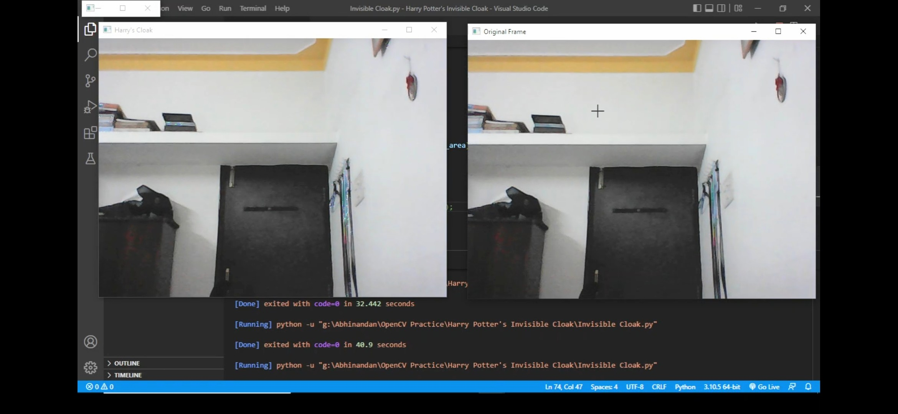
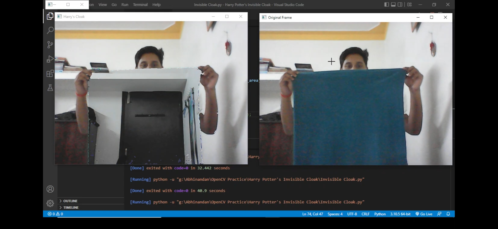
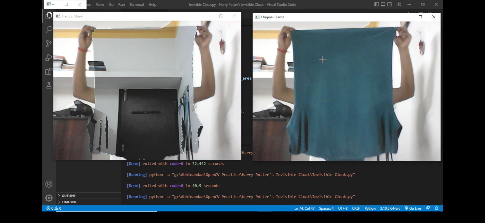

# Harry Potter's Invisibility Cloak using Computer Vision

- This is project uses the concept of computer vision implemented using  ```Python```, ```OpenCv```, ```Numpy```.
- This is opposite **green-screening(which removes background frame)**. Here, it will **remove the foreground blue-colored object**, creating a **sense of invisibility**.

# System Requirements:
- ```Python```
- ```OpenCv``` 
- ```Numpy```
- ```Webcam```


# Algorithm:
- Capture and store the **background frame**.
- Detects the **blue-colored object/cloth** using **color detection**.
- Segment out the blue-colored cloth by generating a **mask**.
- Finally, merges the masked background frame with the real frame, creating a **sense of invisibility**.
# Concepts used:

- **Color Space Conversion**
- **Color Tracking**
- **Image Masking**
- **Image segmentation**

# How to use it:

## Keep the webcam stable and ensure there's nothing initially infront of the camera

### 

## Run the python code

## Let it capture the background frame for few seconds
### 

## When you bring a blue-colored object infront of camera the output would be like this:

 ### 

 ### 


Hope you all like this magical project :heart:
